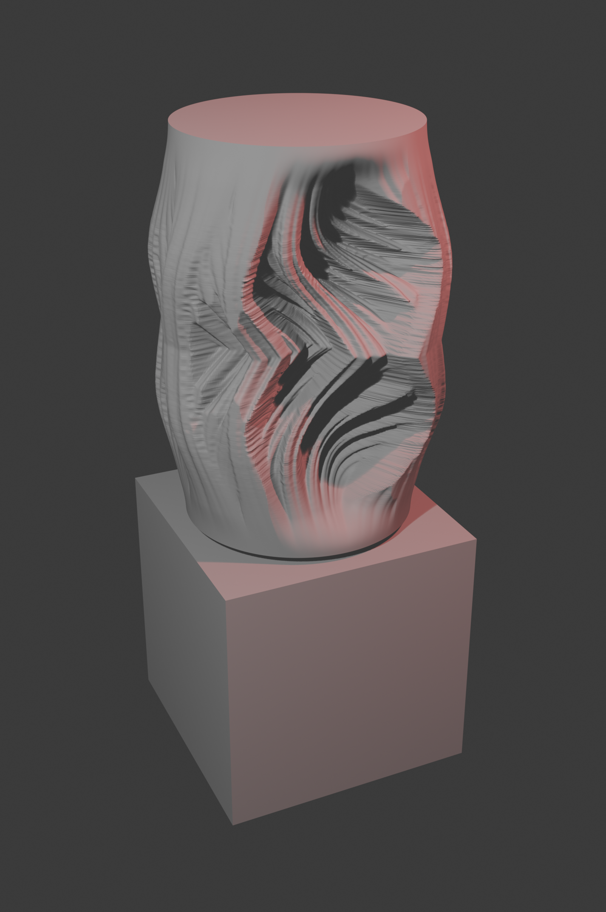
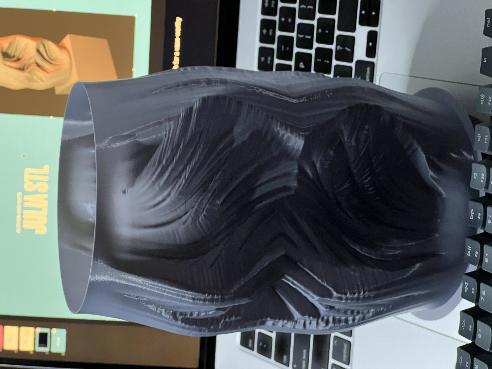
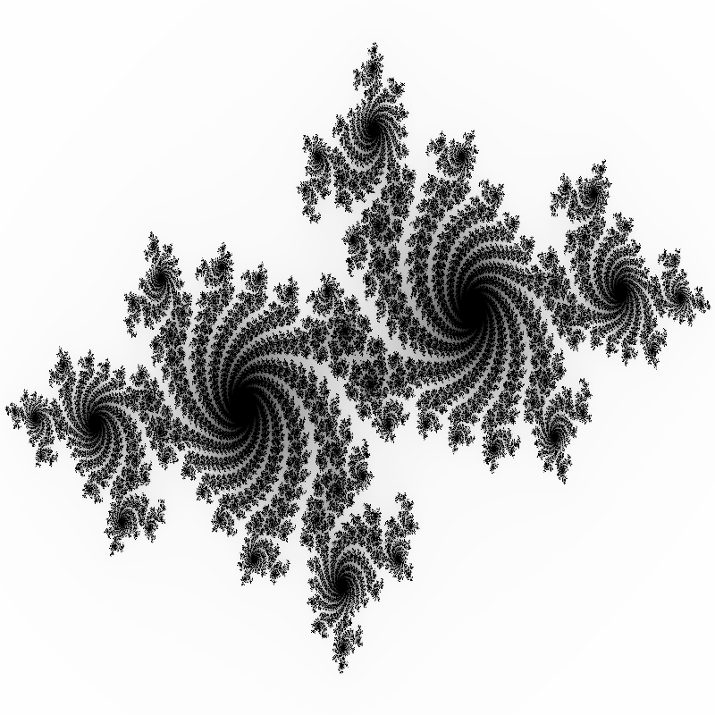
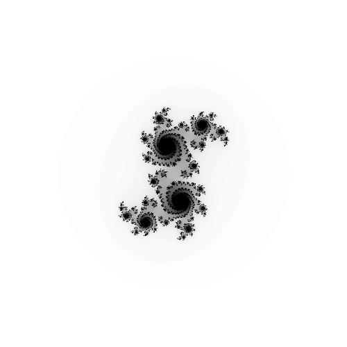
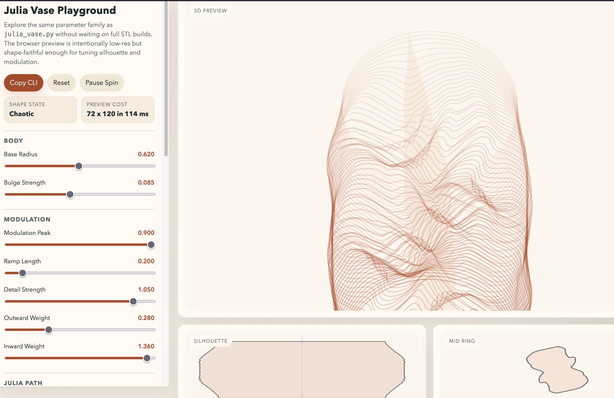
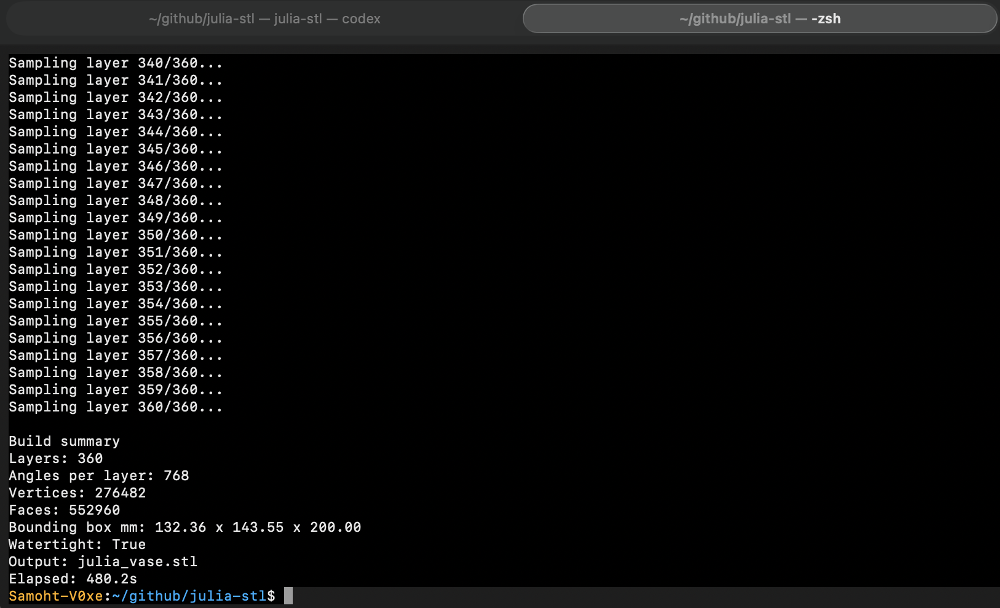

# Julia Set Vase

This directory is included here as one example build inside the larger `uuhackathon2026` submission. It is an interesting hackathon artifact, not a packaged public tool release.

This repository documents a small fractal-to-object project: take Julia-set structure, turn it into a controlled radial deformation, and export the result as a watertight STL for 3D printing. The final object is not a literal fractal solid. It is a vase whose cross-sections become more Julia-like through the middle and resolve back toward circularity at the ends.



## What It Is

- A standalone Python generator for a Julia-set-inspired vase mesh: [julia_vase.py](julia_vase.py)
- A browser playground for rapid parameter tuning: [julia_vase_playground.html](julia_vase_playground.html)
- A documented trail of earlier image-first and point-cloud experiments: [archive/legacy-scripts](archive/legacy-scripts)
- A packaged set of outputs for sharing: renders, print photos, screenshots, STL files, and preview iterations in [assets](assets)

The current best artifact is [assets/models/julia_vase.stl](assets/models/julia_vase.stl). The repo also includes the preview STL series because those intermediate forms turned out to be useful for describing the design space and showing how the shape language evolved.

## How It Was Made

The project moved through three phases:

1. Raster-first exploration  
   Early scripts generated Julia images, extracted contours, and tried to stack or revolve them into geometry. Those files are preserved in [archive/legacy-scripts](archive/legacy-scripts). They were useful for learning, but they produced noisy boundaries and fragile meshes.

2. Point-cloud and perimeter experiments  
   Stacked `.ply` outputs and perimeter extraction helped clarify what kinds of deformation were visually promising. The most useful of those artifacts are in [assets/point-clouds](assets/point-clouds).

3. Ring-based vase generation  
   The breakthrough was to stop treating the Julia set as the literal silhouette and instead treat it as a modulation field around an otherwise stable circular section. [julia_vase.py](julia_vase.py) samples one ordered ring per layer, smooths it, connects all rings into a closed triangle mesh, caps the top and bottom, and exports a watertight STL.

In practical terms, the generator now does this:

- Walk upward through `num_layers`
- Compute a Julia parameter `c` for each height
- Sample the boundary radius at evenly spaced angles
- Normalize the ring around a circular body profile
- Bias inward pulls more strongly than outward growth
- Smooth the result across the ring and between layers
- Build and export a closed mesh with `trimesh`

## Process Notes

This project began with a direct request to turn Julia-set imagery into printable form. The initial interpretation was literal: generate fractal images, extract their edges, and convert those into 3D geometry. That produced artifacts quickly, but the forms were weak.

The working interpretation changed as the outputs improved. Instead of asking “how do we reproduce the Julia set exactly?”, the more useful question became “how do we use Julia structure as a deformation language for a vase?” That shift is the real project. It led to the browser playground, the preview STL series, and the final ring-based mesh generator.

The planning artifacts that guided that transition are kept in [archive/process/julia_vase.plan.md](archive/process/julia_vase.plan.md) and [archive/process/codex-build-prompt.md](archive/process/codex-build-prompt.md).

## Gallery

### Final output

- Render: 
- Print: 
- Canonical STL: [assets/models/julia_vase.stl](assets/models/julia_vase.stl)

### Development references

- Julia source image: 
- 2D slice preview: 
- Playground screenshot: 
- Generator screenshot: 

### Preview progression

Representative previews live in [assets/previews](assets/previews). The most useful checkpoints were:

- `v6`: first convincing “circle plus growing modulation” form
- `v9`: intentionally too aggressive; useful upper bound
- `v11`: symmetry fix
- `v12` and `v13`: more controlled refinements near the current best region

## Repository Layout

```text
.
├── README.md
├── julia_vase.py
├── julia_vase_playground.html
├── assets
│   ├── images
│   ├── models
│   ├── point-clouds
│   └── previews
├── archive
│   ├── blender
│   ├── legacy-scripts
│   └── process
├── learnings.md
├── presentation.md
└── roadmap.md
```

## Running It

Create a virtual environment and install the small dependency set:

```bash
python3 -m venv .venv
source .venv/bin/activate
pip install numpy trimesh pillow matplotlib opencv-python numpy-stl
```

Or install from the included [requirements.txt](requirements.txt):

```bash
pip install -r requirements.txt
```

Generate the canonical STL:

```bash
python3 julia_vase.py
```

Generate a faster preview build:

```bash
python3 julia_vase.py --preview
```

Outputs are written to:

- final STL: `assets/models/julia_vase.stl`
- preview STL: `assets/previews/julia_vase_preview.stl`

Open [julia_vase_playground.html](julia_vase_playground.html) in a browser to explore the same shape language interactively.

## Related Notes

- Project learnings: [learnings.md](learnings.md)
- Sharing / presentation framing: [presentation.md](presentation.md)
- Next-step roadmap: [roadmap.md](roadmap.md)
